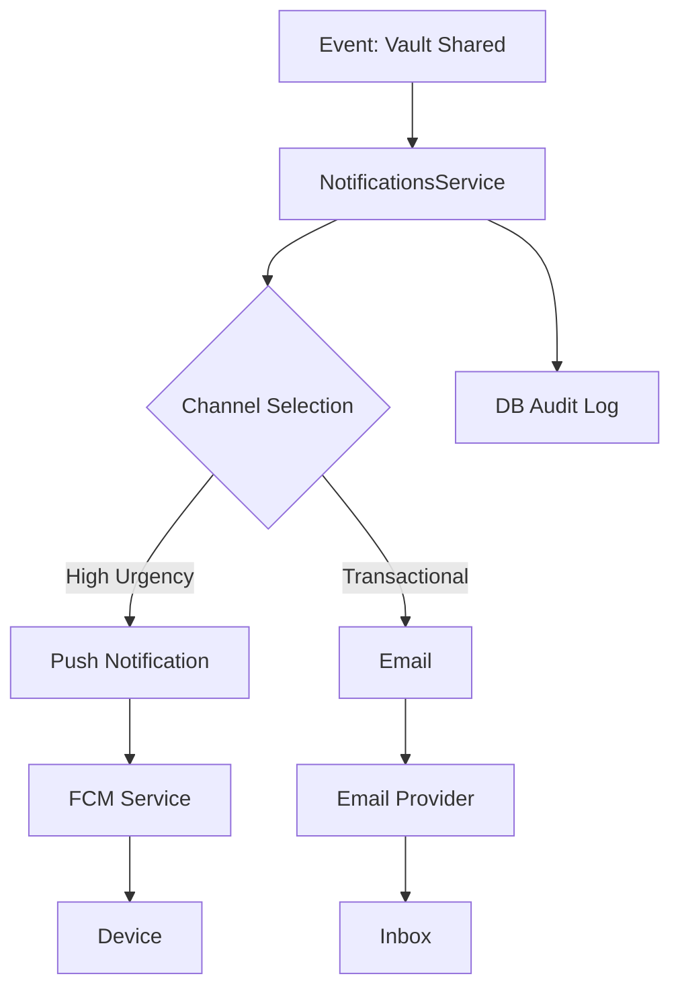

# Notifications Flow

## Strategy

We use an orchestration pattern where `NotificationsService` acts as the central hub. It decides _how_ to notify based on urgency and user preferences.

## Flow Diagram

## Channels

1. **Push (FCM)**:
   - Used for: Real-time alerts, Security warnings, Chat messages.
   - Priority: High.
2. **Email (SMTP)**:
   - Used for: Account lifecycle, Weekly summaries, "Permanent" records.
   - Priority: Medium.

## Orchestration Logic

Currently hardcoded in `NotificationsService`. Future iterations will add a `UserPreference` lookup to check if a user has opted out of specific channels.
